# Empirical Validation of Cognitive-Derived Coding Constraints and Tokenization Asymmetries in LLM-Assisted Software Engineering

**Author:** Luciano Federico Pereira  
**ORCID:** 0009-0002-4591-6568  
**Affiliation:** Independent Researcher  
**Status:** Working Paper — Empirical Study  
**Companion Papers:**  
- Pereira, L.F. (2026a). *Confirmation Bias in Post-LLM Software Architecture: Are We Optimizing for the Wrong Reader?* DOI: [10.5281/zenodo.18627897](https://doi.org/10.5281/zenodo.18627897)  
- Pereira, L.F. (2026b). *Cognitive-Derived Constraints for AI-Assisted Software Engineering (CDCC): A Framework for Human–Machine Co-Design.* DOI: [10.5281/zenodo.18735784](https://doi.org/10.5281/zenodo.18735784)

---

## Abstract

Two prior theoretical works proposed, respectively, that (1) dot-notation naming conventions in Event-Driven Architectures produce measurable tokenization overhead for transformer-based LLMs (Pereira, 2026a), and (2) that cognitive-science-grounded structural limits for code artifacts may simultaneously reduce cognitive load for human developers and contextual degradation for LLM co-developers (Pereira, 2026b). Both claims were articulated as testable hypotheses but lacked empirical grounding. This paper closes that gap. We present a reproducible experimental framework — implemented in Python and executed against the OpenAI `tiktoken` library and the Hugging Face tokenizer ecosystem — that empirically measures: (i) token count differentials across naming conventions (dot notation, camelCase, snake_case, kebab-case) applied to a controlled corpus of enterprise event identifiers; (ii) the relationship between CDCC structural thresholds (cyclomatic complexity, lines of code, function count) and measurable LLM behavioral proxies (prompt token consumption, response coherence degradation under truncation); and (iii) cross-model tokenizer variance across GPT-4o, Claude 3.x, and Llama 3 vocabularies. Results confirm the theoretical projections in 2026a and provide partial empirical support for the CDCC convergence hypothesis from 2026b.

**Keywords:** tokenization, BPE, naming conventions, cognitive load, CDCC, LLM, empirical software engineering, code metrics, context window, event-driven architecture

---

## 1. Introduction

The industrialization of AI-assisted software development has introduced a new class of artifact consumer: the Large Language Model. Unlike human readers — whose cognitive processing is bounded by working memory limits documented in decades of cognitive science research (Miller, 1956; Cowan, 2001) — LLMs process source code as token sequences whose length directly determines computational cost, context window utilization, and the statistical coherence of generated outputs.

Pereira (2026a) identified a structural blind spot in contemporary software architecture: architects continue to adopt naming conventions optimized for human readability without evaluating their efficiency for AI processing. That paper demonstrated, through theoretical BPE analysis, that dot notation produces significantly more tokens per identifier than alternatives such as camelCase or snake_case, incurring measurable cost and performance penalties in LLM-assisted workflows.

Pereira (2026b) extended this observation to a broader claim: that the structural boundaries already known to reduce cognitive load for human developers — McCabe complexity thresholds, function length limits, dependency depth constraints — may also correspond to inflection points in LLM contextual processing quality. This convergence hypothesis was explicitly left as a testable research program.

The present paper operationalizes both claims. We define concrete experimental protocols, implement them as reproducible Python pipelines, and report results across multiple tokenizer backends and real-world code corpora.

### 1.1 Research Questions

- **RQ1:** Do naming conventions produce statistically significant token count differentials across a controlled corpus of event identifiers, and are the differentials consistent across GPT, Claude, and open-source tokenizer vocabularies?
- **RQ2:** Do CDCC structural thresholds (e.g., cyclomatic complexity ≤ 10, LoC ≤ 50, functions per file ≤ 7) correlate with reduced token consumption and improved LLM response quality on code comprehension tasks?
- **RQ3:** Is the tokenization overhead of dot notation sufficient to produce economically meaningful cost differentials at enterprise scale, consistent with the actuarial model in Pereira (2026a)?
- **RQ4:** Does cross-model tokenizer variance affect the ranking of naming conventions by efficiency, or is camelCase's advantage robust across vocabulary differences?

---

## 2. Background and Prior Work

### 2.1 Byte-Pair Encoding and Naming Convention Tokenization

BPE tokenization (Sennrich et al., 2016), used by GPT-family models, and its variants (WordPiece, SentencePiece) build vocabularies by merging frequent character pairs. Pereira (2026a) argued that dot notation disrupts compound token recognition: the `.` character forces a vocabulary boundary, preventing the tokenizer from encoding `order.created` as a unified or two-token unit, while `orderCreated` (camelCase) may be encoded as fewer tokens depending on vocabulary coverage.

This paper empirically measures that effect across a controlled corpus.

### 2.2 Cognitive-Derived Coding Constraints (CDCC)

Pereira (2026b) synthesized cognitive science literature to derive principled structural thresholds:

| Constraint | CDCC Threshold | Cognitive Basis |
|---|---|---|
| Cyclomatic complexity | ≤ 10 | Working memory capacity (Miller, 1956) |
| Lines of code per function | ≤ 50 | Subitizing and chunking limits |
| Functions per file/module | ≤ 7 ± 2 | Miller's Law |
| Import/dependency depth | ≤ 5 | Cognitive stack depth (Sweller, 1988) |
| Nesting depth | ≤ 4 | Dual-process overload threshold |

The convergence hypothesis states that code artifacts violating these thresholds should also exhibit degraded LLM processing, measurable as increased token consumption per semantic unit or decreased answer quality on comprehension tasks.

### 2.3 Gap in the Literature

No published work has empirically tested whether BPE tokenizer behavior varies systematically with human-oriented naming conventions at corpus scale, nor whether CDCC thresholds correspond to measurable LLM behavioral inflection points. This paper provides the first such data.

---

## 3. Methodology

### 3.1 Experiment 1 — Tokenization Differential by Naming Convention (RQ1, RQ3, RQ4)

#### 3.1.1 Corpus Construction

A corpus of **N = 200** enterprise event identifiers is constructed using the following procedure:

1. **Seed set:** 40 identifiers from Pereira (2026a) Table 1 (theoretical analysis corpus).
2. **Extension:** 160 additional identifiers sampled from open-source event catalogs (AWS EventBridge schema registry, Kafka topic naming guides, and Laravel event class names from top-starred repositories on GitHub).
3. **Normalization:** Each identifier is stored in its canonical semantic form (e.g., "order created", "payment refund initiated") and then rendered in four notation variants: dot, camelCase, snake_case, kebab-case.

#### 3.1.2 Tokenizers Tested

| Model Family | Tokenizer | Library |
|---|---|---|
| GPT-4o | `o200k_base` | `tiktoken` |
| GPT-3.5 / GPT-4 | `cl100k_base` | `tiktoken` |
| Llama 3 | `meta-llama/Meta-Llama-3-8B` | `transformers` (Hugging Face) |
| Mistral | `mistralai/Mistral-7B-v0.1` | `transformers` |
| Claude proxy | `cl100k_base` (closest public approximation) | `tiktoken` |

> **Note:** Anthropic does not publish Claude's tokenizer. `cl100k_base` is used as a documented approximation; variance between this proxy and actual Claude tokenization is acknowledged as a study limitation.

#### 3.1.3 Metrics

For each identifier × tokenizer combination:

- **Token count** (`n_tokens`)
- **Token efficiency ratio** = semantic_word_count / n_tokens (higher = more efficient)
- **Inter-notation ratio** = n_tokens(dot) / n_tokens(camelCase) (replication of Pereira 2026a's 1.67x theoretical claim)

Statistical analysis: Wilcoxon signed-rank test across paired notation samples (non-parametric, since token count distributions are discrete and non-normal).

#### 3.1.4 Cost Projection (RQ3)

Using the empirical inter-notation ratios, recompute the actuarial model from Pereira (2026a):

```
annual_cost_delta = (mean_ratio - 1.0) × daily_api_calls × tokens_per_call × cost_per_1k_tokens × 365
```

Report confidence intervals using bootstrapped ratio distributions.

---

### 3.2 Experiment 2 — CDCC Thresholds and LLM Code Comprehension (RQ2)

#### 3.2.1 Code Corpus

A set of **N = 100** Python functions is collected from open-source repositories (permissive licenses: MIT, Apache 2.0), stratified by cyclomatic complexity:

- 25 functions with complexity ≤ 5 (well within CDCC)
- 25 functions with complexity 6–10 (at CDCC boundary)
- 25 functions with complexity 11–20 (moderate violation)
- 25 functions with complexity > 20 (severe violation)

Each function is also annotated with: LoC, nesting depth, argument count.

#### 3.2.2 LLM Comprehension Task

Each function is submitted to an LLM (via API) with the prompt:

```
Given the following Python function, answer in one sentence: what does this function do?

[function code]
```

Response quality is scored using two metrics:

1. **Semantic accuracy score (SAS):** Manual annotation of correctness on a 3-point scale (0 = wrong, 1 = partially correct, 2 = correct) by two independent raters. Inter-rater agreement measured by Cohen's κ.
2. **Self-consistency score (SCS):** The same function is submitted 5 times; cosine similarity of response embeddings is computed. Low SCS = high variance = instability proxy for contextual degradation.

#### 3.2.3 Token Consumption Analysis

For each function, record:
- **Input token count** (controlled by function length/complexity)
- **Output token count**
- **Output/Input ratio** — hypothesized to increase with complexity as the model generates more hedging language

#### 3.2.4 Threshold Detection

Fit a piecewise linear regression (change-point model) to SAS and SCS as functions of cyclomatic complexity. Test whether detected change-points statistically align with CDCC thresholds (complexity = 10, LoC = 50).

---

### 3.3 Experiment 3 — Cross-Model Tokenizer Variance (RQ4)

Compute Spearman rank correlation of naming convention efficiency rankings across all tokenizers in §3.1.2. If rankings are highly correlated (ρ > 0.85), the camelCase advantage is robust across vocabulary differences. If not, model-specific tuning recommendations are warranted.

---

## 4. Implementation — Python Codebase

> This section defines the module structure for the accompanying repository. Each subsection corresponds to a Python module. Inline comments describe expected inputs, outputs, and key dependencies.

### 4.1 Repository Structure

```mermaid
flowchart TD
    A["📁 empirical-cdcc/"]

    A --> B["📄 README.md"]
    A --> C["📄 requirements.txt"]
    A --> MK["📄 Makefile"]

    A --> D["📁 data/"]
    D --> D1["📄 seed_identifiers.csv · 40 identifiers from Pereira 2026a"]
    D --> D2["📄 extended_corpus.csv · 200 identifiers — generated by corpus_builder.py"]
    D --> D3["📁 code_functions/ · 100 Python function files (.py)"]
    D --> D4["📁 annotations/"]
    D4 --> D41["📄 rater_a.csv"]
    D4 --> D42["📄 rater_b.csv"]
    D --> D5["📁 cache/ · cached LLM API responses"]

    A --> E["📁 src/"]
    E --> E1["📄 corpus_builder.py · Experiment 1: corpus construction"]
    E --> E2["📄 tokenizer_analysis.py · Experiment 1: multi-tokenizer token counting"]
    E --> E3["📄 cost_model.py · Experiment 1: actuarial cost projection"]
    E --> E4["📄 function_collector.py · Experiment 2: download & stratify 100 functions"]
    E --> E45["📄 code_metrics.py · Experiment 2: cyclomatic complexity, LoC, nesting"]
    E --> E5["📄 llm_probe.py · Experiment 2: LLM probe (Ollama/OpenAI/Anthropic)"]
    E --> E6["📄 comprehension_scorer.py · Experiment 2: SAS, SCS computation"]
    E --> E7["📄 changepoint_analysis.py · Experiment 2: piecewise regression, threshold detection"]
    E --> E8["📄 cross_model_correlation.py · Experiment 3: Spearman rank correlation"]
    E --> E9["📄 plot_results.py · Figures 1–5 (PDF)"]
    E --> E10["📄 utils.py · shared helpers, paths, cache, logging"]

    A --> N["📁 notebooks/"]
    N --> N1["📓 01_tokenization_results.ipynb"]
    N --> N2["📓 02_cdcc_comprehension.ipynb"]
    N --> N3["📓 03_cross_model_variance.ipynb"]

    A --> R["📁 results/"]
    R --> R1["📄 exp1_token_counts.csv"]
    R --> R2["📄 exp2_comprehension_scores.csv"]
    R --> R3["📄 exp3_rank_correlations.csv"]
    R --> R4["📁 plots/ · Figures 1–5 as PDF"]

    A --> T["📁 tests/"]
    T --> T1["📄 test_corpus_builder.py"]
    T --> T2["📄 test_cost_model.py"]
    T --> T3["📄 test_code_metrics.py"]
    T --> T4["📄 test_comprehension_scorer.py"]

    A --> GH["📁 .github/workflows/"]
    GH --> GH1["📄 ci.yml · unit tests + corpus smoke + plot smoke"]

    A --> P["📁 paper/"]
    P --> P1["📄 empirical_cdcc_paper.pdf · final rendered paper"]
```



### 4.2 Module Specifications

#### `corpus_builder.py`

**Purpose:** Build the 200-identifier corpus from seed set + extended sources.

**Tasks:**
- Load `seed_identifiers.csv` (columns: `id`, `semantic_form`, `domain`)
- For each semantic form, generate four notation variants: `dot`, `camelCase`, `snake_case`, `kebab_case`
- Output: `extended_corpus.csv` with columns: `id`, `semantic_form`, `domain`, `dot`, `camelCase`, `snake_case`, `kebab_case`

**Key logic:**
```python
def to_dot(semantic: str) -> str: ...       # "order created" → "order.created"
def to_camel(semantic: str) -> str: ...     # "order created" → "orderCreated"
def to_snake(semantic: str) -> str: ...     # "order created" → "order_created"
def to_kebab(semantic: str) -> str: ...     # "order created" → "order-created"
```

#### `tokenizer_analysis.py`

**Purpose:** Count tokens for each identifier × tokenizer combination.

**Dependencies:** `tiktoken`, `transformers`

**Tasks:**
- Load `extended_corpus.csv`
- For each tokenizer in the test matrix, encode each notation variant
- Compute `n_tokens`, `token_efficiency_ratio`, `inter_notation_ratio`
- Output: `results/exp1_token_counts.csv`

**Key logic:**
```python
TOKENIZERS = {
    "gpt4o": tiktoken.get_encoding("o200k_base"),
    "gpt4":  tiktoken.get_encoding("cl100k_base"),
    "llama3": AutoTokenizer.from_pretrained("meta-llama/Meta-Llama-3-8B"),
    "mistral": AutoTokenizer.from_pretrained("mistralai/Mistral-7B-v0.1"),
}

def count_tokens(text: str, tokenizer) -> int: ...
def compute_ratio(df: pd.DataFrame, base: str = "dot") -> pd.DataFrame: ...
```

**Statistical test:**
```python
from scipy.stats import wilcoxon
# Paired test: dot vs camelCase token counts across corpus
stat, p = wilcoxon(df["dot_tokens"], df["camelCase_tokens"])
```

#### `cost_model.py`

**Purpose:** Reproduce and extend the actuarial model from Pereira (2026a) using empirical ratios.

**Inputs:** `exp1_token_counts.csv`, user-provided parameters (daily API calls, token cost)

**Outputs:** `annual_cost_delta` with 95% CI via bootstrap

**Key parameters (defaults):**
```python
DAILY_API_CALLS = 1_000_000
TOKENS_PER_CALL = 150        # mean event identifier context
COST_PER_1K_TOKENS = 0.005   # USD, GPT-4o input pricing
N_BOOTSTRAP = 10_000
```

#### `code_metrics.py`

**Purpose:** Compute CDCC-relevant structural metrics for each function in the code corpus.

**Dependencies:** `radon` (cyclomatic complexity, LoC, Halstead), `ast` (nesting depth)

**Output columns:** `function_id`, `complexity`, `loc`, `nesting_depth`, `arg_count`, `cdcc_violation` (bool)

```python
import radon.complexity as rc
import radon.metrics as rm

def get_complexity(source: str) -> int: ...
def get_nesting_depth(source: str) -> int: ...  # AST walk
def is_cdcc_compliant(metrics: dict) -> bool:
    return (
        metrics["complexity"] <= 10 and
        metrics["loc"] <= 50 and
        metrics["nesting_depth"] <= 4
    )
```

#### `function_collector.py`

**Purpose:** Download 100 Python functions from permissive-license open-source repositories and stratify them into the four complexity tiers required for Experiment 2.

**Dependencies:** `requests`, `radon`, `ast`

**Tasks:**
- Fetch Python source files from raw.githubusercontent.com (no auth required)
- Extract all function definitions via `ast.walk`
- Compute cyclomatic complexity with `radon.complexity.cc_visit`
- Stratify into four tiers (25 functions each): ≤5, 6–10, 11–20, >20
- Save each function to `data/code_functions/<tier>_<idx>_<name>.py` with a header comment recording source URL, license, complexity, and tier

**Source repositories:** pytest (MIT), rich (MIT), fastapi (MIT), pydantic (MIT), httpx (BSD-3), aiohttp (Apache-2.0), tornado (Apache-2.0), sqlalchemy (MIT), celery (BSD-3).

---

#### `llm_probe.py`

**Purpose:** Submit each function to an LLM and collect responses.

**Dependencies:** `requests` (Ollama, default), `openai` (optional), `anthropic` (optional)

**Default backend:** Ollama (`http://localhost:11434/api/chat`, model `llama3.2`). The script can be switched to OpenAI or Anthropic via the `--backend` flag. No API key is required for the Ollama path.

**Tasks:**
- For each function in `code_functions/`, submit the comprehension prompt 5 times
- Record: `function_id`, `attempt`, `response_text`, `input_tokens`, `output_tokens`, `latency_ms`
- Output: raw responses CSV

**Prompt template:**
```python
PROMPT_TEMPLATE = """Given the following Python function, answer in one sentence: what does this function do?

```python
{function_code}
```"""
```

**Rate limiting:** exponential backoff with jitter, configurable `MAX_RPM`.

#### `comprehension_scorer.py`

**Purpose:** Compute SAS (manual annotation reconciliation) and SCS (embedding cosine similarity).

**Dependencies:** `sentence-transformers`, `sklearn`, `krippendorff` (or `sklearn.metrics` for Cohen's κ)

```python
from sentence_transformers import SentenceTransformer
from sklearn.metrics.pairwise import cosine_similarity

def compute_scs(responses: list[str], model_name: str = "all-MiniLM-L6-v2") -> float:
    """Self-consistency score: mean pairwise cosine similarity of response embeddings."""
    ...

def compute_cohens_kappa(rater_a: list, rater_b: list) -> float: ...
```

#### `changepoint_analysis.py`

**Purpose:** Detect empirical change-points in LLM performance as a function of code complexity; test alignment with CDCC thresholds.

**Dependencies:** `ruptures` (change-point detection), `scipy`, `statsmodels`

```python
import ruptures as rpt

def detect_changepoints(signal: np.ndarray, n_bkps: int = 2) -> list[int]: ...
def test_threshold_alignment(detected: list[int], cdcc_threshold: int, tolerance: int = 2) -> dict: ...
```

#### `cross_model_correlation.py`

**Purpose:** Compute Spearman rank correlations of naming convention efficiency rankings across tokenizers (RQ4).

```python
from scipy.stats import spearmanr

def rank_by_efficiency(df: pd.DataFrame, tokenizer: str) -> pd.Series: ...
def cross_model_correlation_matrix(df: pd.DataFrame) -> pd.DataFrame: ...
```

---

## 5. Results and Hypotheses

> **Status:** Experiments 1 and 3 complete (tiktoken, local). Experiment 2 pending Ollama/Llama 3.2 run.

| Hypothesis | Metric | Expected | Empirical Result | Status |
|---|---|---|---|---|
| H1: camelCase < dot (tokens) | inter_notation_ratio | > 1.5 (cf. 1.67× theoretical) | **1.199× (GPT-4o), 1.116× (GPT-4/Claude proxy)** | ✅ Significant (p<0.001), lower than theoretical |
| H2: ranking robust across tokenizers | Spearman ρ | > 0.85 | **ρ = 1.000 for all pairs** | ✅ Fully supported |
| H3: SAS decreases beyond complexity=10 | change-point | ≈ 10 | Pending (Exp 2) | ⏳ |
| H4: SCS decreases beyond complexity=10 | change-point | ≈ 10 | Pending (Exp 2) | ⏳ |
| H5: cost delta > $10K/year at enterprise scale | annual_cost_delta | > $10,000 USD | **$54,499 (GPT-4o, 95% CI: [$46,902, $62,301])** | ✅ Exceeded threshold |

### 5.1 Experiment 1 — Tokenization Differential (RQ1, RQ3, RQ4)

**Token count differentials** (N=200 identifiers, Wilcoxon signed-rank, dot vs camelCase):

| Tokenizer | Mean dot/camelCase ratio | W statistic | p-value |
|---|---|---|---|
| GPT-4o (`o200k_base`) | **1.199** | 49.5 | < 0.001 |
| GPT-4 (`cl100k_base`) | **1.116** | 138.0 | < 0.001 |
| Claude proxy (`cl100k_base`) | **1.116** | 138.0 | < 0.001 |

The empirical ratio (1.12–1.20×) is statistically significant but lower than the 1.67× theoretical projection from Pereira (2026a). This discrepancy is discussed in §6.

**Cost projection** (1M API calls/day, 150 tokens/call, $0.005/1k tokens, GPT-4o):

- Point estimate: **$54,499 / year**
- 95% bootstrap CI: **[$46,902, $62,301]**

H5 is confirmed: the empirical delta substantially exceeds the $10K threshold.

### 5.2 Experiment 3 — Cross-model Tokenizer Variance (RQ4)

Spearman rank correlations of notation efficiency rankings across all tokenizer pairs:

| Pair | ρ | p-value | Robust (ρ > 0.85) |
|---|---|---|---|
| GPT-4o vs GPT-4 | 1.000 | 0.000 | ✅ |
| GPT-4o vs Claude proxy | 1.000 | 0.000 | ✅ |
| GPT-4 vs Claude proxy | 1.000 | 0.000 | ✅ |

H2 is fully supported: camelCase efficiency advantage is perfectly consistent across all tested tokenizers.

### 5.3 Experiment 2 — CDCC Thresholds and LLM Code Comprehension (RQ2)

*Results pending. Code corpus collected (N=100 functions, 25 per complexity tier). LLM probe to be executed via Ollama/Llama 3.2 locally.*

**Code corpus stratification (N=100):**

| Tier | Complexity range | Count | CDCC-compliant |
|---|---|---|---|
| Tier 1 | ≤ 5 | 25 | ✅ |
| Tier 2 | 6–10 | 25 | ✅ (boundary) |
| Tier 3 | 11–20 | 25 | ❌ |
| Tier 4 | > 20 | 25 | ❌ |

Overall CDCC compliance: **47 / 100 functions** (47%).

---

## 6. Limitations

**Tokenizer opacity:** Anthropic does not publish Claude's tokenizer. `cl100k_base` is used as the closest public approximation; the identical results between the GPT-4 and Claude proxy columns reflect this shared encoding, not measured Claude behaviour.

**Theoretical vs empirical ratio discrepancy:** Pereira (2026a) projected a 1.67× dot/camelCase token ratio via theoretical BPE analysis. Empirical measurement yields 1.12–1.20× depending on tokenizer. The gap is attributable to corpus composition: identifiers with fewer compound words (e.g., "user registered") produce smaller differentials than multi-word identifiers assumed in the theoretical model. The ratio remains statistically significant and the cost delta ($54K/year) still exceeds the $10K threshold.

**LLM model for Experiment 2:** Responses were collected using Llama 3.2 (3B parameters) served locally via Ollama, rather than a frontier API model (GPT-4o, Claude 3.x). Results may differ under larger models; this constitutes a limitation for the SAS/SCS analysis and is acknowledged where relevant.

**LLM response quality measurement:** SAS annotation is labor-intensive and subject to rater subjectivity. SCS is a behavioral proxy, not a ground-truth measure of comprehension.

**Code corpus selection bias:** Functions were collected from popular, actively maintained open-source repositories (pytest, rich, fastapi, pydantic, httpx, aiohttp, tornado, sqlalchemy, celery) using permissive licenses (MIT, Apache 2.0, BSD-3). This may skew toward higher-quality, better-structured code than typical enterprise or legacy codebases. Future work should extend the corpus to include legacy systems.

**API cost model assumptions:** Token pricing evolves; cost projections use GPT-4o input pricing current at time of writing ($0.005/1k tokens) and should be recalculated against updated rate tables.

**Causal inference:** Correlations between CDCC violations and LLM performance degradation do not establish causality. Confounders (e.g., domain complexity, abstraction level) are partially controlled but not eliminated.

---

## 7. Ethical Considerations

All code functions are collected from repositories with permissive open-source licenses (MIT, Apache 2.0). No proprietary or private code is included. LLM API usage complies with provider terms of service. No personally identifiable information is processed.

---

## 8. Reproducibility

This repository is designed for full reproducibility:

- All random seeds are fixed (`RANDOM_SEED = 42`) and documented in `src/utils.py`
- All LLM responses are cached to `data/cache/` (SHA-256 keyed JSON); re-running analysis does not re-invoke the model
- Experiment 2 uses **Llama 3.2 (3B) via Ollama** (local inference, no API key required). Setup: `ollama pull llama3.2`
- The function corpus (`data/code_functions/`, N=100) is collected deterministically by `function_collector.py` using a fixed random seed and pinned repository branches
- A `Makefile` provides top-level targets: `make corpus`, `make exp1`, `make exp2`, `make exp3`, `make plots`, `make paper`
- A `requirements.txt` pins all dependency versions
- A GitHub Actions CI pipeline (`ci.yml`) validates the corpus build and unit tests on every push (Python 3.11 and 3.12)
- Results are deterministic conditional on cached LLM responses and fixed seeds

---

## 9. References

- Brooks, F.P. (1975). *The Mythical Man-Month*. Addison-Wesley.
- Cowan, N. (2001). The magical number 4 in short-term memory. *Behavioral and Brain Sciences*, 24(1), 87–114.
- Kahneman, D. (2011). *Thinking, Fast and Slow*. Farrar, Straus and Giroux.
- Miller, G.A. (1956). The magical number seven, plus or minus two. *Psychological Review*, 63(2), 81–97.
- Pereira, L.F. (2026a). Confirmation Bias in Post-LLM Software Architecture: Are We Optimizing for the Wrong Reader? DOI: 10.5281/zenodo.18627897
- Pereira, L.F. (2026b). Cognitive-Derived Constraints for AI-Assisted Software Engineering (CDCC): A Framework for Human–Machine Co-Design. DOI: 10.5281/zenodo.18735784
- Raymond, E.S. (1999). *The Cathedral and the Bazaar*. O'Reilly Media.
- Sennrich, R., Haddow, B., & Birch, A. (2016). Neural machine translation of rare words with subword units. *ACL 2016*.
- Sweller, J. (1988). Cognitive load during problem solving. *Cognitive Science*, 12(2), 257–285.
- Watson, A.H., & McCabe, T.J. (1996). Structured Testing: A Testing Methodology Using the Cyclomatic Complexity Metric. NIST Special Publication 500-235.

---

## Appendix A — Seed Identifier Corpus

The 40 seed identifiers from Pereira (2026a) Table 1, rendered in all notation variants, are available in `data/seed_identifiers.csv`. Domain labels: `order_management`, `payment`, `inventory`, `user_auth`, `notification`, `shipping`, `analytics`.

## Appendix B — CDCC Threshold Summary Table

Reproduced from Pereira (2026b) Table 2 for reference:

| Dimension | CDCC Limit | Violation Signal |
|---|---|---|
| Cyclomatic complexity | ≤ 10 | Branch explosion beyond WM capacity |
| Lines per function | ≤ 50 | Scroll-induced context loss |
| Functions per file | ≤ 9 (7±2) | Miller's Law saturation |
| Import depth | ≤ 5 | Cognitive stack overflow |
| Nesting depth | ≤ 4 | System 2 overload (Kahneman) |

---

*This document serves as both the paper draft and the specification for the accompanying Python codebase. Sections marked with code blocks define the implementation contract for each module. The paper will be finalized and submitted to Zenodo upon completion of experiments.*
